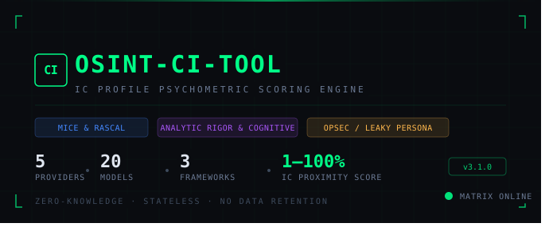

      

# OSINT-CI-TOOL
### IC Profile Psychometric Scoring Engine · v3.1.0

A behavioral OSINT analysis tool that scores LinkedIn profiles (1–100%) for intelligence community (IC) involvement using three validated psychological frameworks. Supports five AI providers and 20 model engines across a unified interface.

---

## Table of Contents

1. [Project Structure](#project-structure)
2. [Psychological Framework Architecture](#psychological-framework-architecture)
3. [Model Registry — v3.1.0 Changelog](#model-registry--v310-changelog)
4. [Output Schema](#output-schema)
5. [IC Proximity Score Thresholds](#ic-proximity-score-thresholds)
6. [Quickstart](#quickstart)
7. [Architecture Overview](#architecture-overview)
8. [Security Design](#security-design)
9. [Environment Variables](#environment-variables)
10. [Deployment](#deployment)

---

## Project Structure

```
osint-ci-tool/
├── .gitignore
├── README.md
│
├── standalone/
│   └── index.html                  ← Zero-dependency single-file build
│                                     (all 5 providers, 20 models)
│
└── fullstack/
    ├── docker-compose.yml           ← One-command local dev environment
    │
    ├── backend/
    │   ├── main.py                  ← FastAPI async proxy server
    │   ├── config.py                ← Model allowlist, env vars, prompt matrix
    │   ├── requirements.txt         ← Pinned Python dependencies
    │   ├── Dockerfile
    │   └── .env.example
    │
    └── frontend/
        ├── index.html
        ├── package.json             ← v3.1.0, React 18 + Vite 6
        ├── vite.config.js
        ├── .env.example
        └── src/
            ├── main.jsx             ← React entry point
            └── App.jsx              ← Full multi-provider UI component
```

---

## Psychological Framework Architecture

### 1. MICE & Rascal Framework
Analyzes motivational vectors and behavioral vulnerabilities:
- Ego/status-seeking language paired with vague institutional scopes
- Ideological alignment to national security discourse
- Institutional restlessness — lateral shifts between boutique defense contractors
- Explicit clearance/classification keyword density

### 2. Analytic Rigor & Cognitive Style Scale
Maps linguistic output against IC cognitive selection criteria:
- General Intelligence (g) proxy indicators
- Structured Analytic Technique (SAT) language markers
- Probabilistic hedging (`likely`, `assessed`, `probable`, `indicates`)
- Big Five: High Openness (Intellect) + High Conscientiousness

### 3. OPSEC Obfuscation vs. "Leaky" Persona Model
Analyzes the tension between professional transparency and operational security:
- Anomalous Anonymity (vague title at known IC employer with zero task detail)
- Institutional jargon density (SIGINT, HUMINT, ISR, GEOINT, C4ISR, all-source)
- Skill/title contradiction — high-level technical skills under a generic corporate title
- IC pipeline education (Georgetown MSFS, National Intelligence University, NDU, SAIS, Fletcher)
- 5-Eyes partner agency references

### Dynamic Weighting
The LLM dynamically assigns weights to each framework (summing to 100%) based on which signal category dominates the analyzed profile. A sparse DoD profile weights the OPSEC model heavier; a verbose defense analyst weights Analytic Rigor higher.

---

## Model Registry — v3.1.0 Changelog

Registry verified against first-party provider documentation as of **July 30, 2026**.

### Anthropic (Claude) — `protocol: backend` (proxied) / `anthropic` (direct)

| Model ID | Display Name | Badge | Status |
|---|---|---|---|
| `claude-opus-4-7` | Claude Opus 4.7 | LATEST | ✅ Added v3.1.0 |
| `claude-sonnet-4-6` | Claude Sonnet 4.6 | — | ✅ Added v3.1.0 |
| `claude-opus-4-20250514` | Claude Opus 4 | — | Carried from v2.x |
| `claude-sonnet-4-20250514` | Claude Sonnet 4 | — | Carried from v2.x |
| `claude-haiku-4-5-20251001` | Claude Haiku 4.5 | FAST | Carried from v2.x |

**v3.1.0 changes:** Added `claude-opus-4-7` as the new default flagship (dateless snapshot format, introduced with the Claude 4.6+ generation). Added `claude-sonnet-4-6` as the balanced mid-tier option. Default model in `config.py` and `backend/.env.example` updated from `claude-sonnet-4-20250514` → `claude-opus-4-7`.

---

### OpenAI (GPT) — `protocol: openai`

| Model ID | Display Name | Badge | Status |
|---|---|---|---|
| `gpt-5.6-sol` | GPT-5.6 Sol (Flagship) | LATEST | ✅ Added v3.1.0 |
| `gpt-5.6-terra` | GPT-5.6 Terra (Balanced) | — | ✅ Added v3.1.0 |
| `gpt-5.6-luna` | GPT-5.6 Luna (Economy) | FAST | ✅ Added v3.1.0 |
| `gpt-4.1` | GPT-4.1 | — | ✅ Added v3.1.0 |
| `gpt-4.1-mini` | GPT-4.1 mini | — | ✅ Added v3.1.0 |

**v3.1.0 changes:** Replaced the stale v3.0.0 entries (`gpt-5.5-preview`, `gpt-4o`) in full. The GPT-5.6 family (Sol / Terra / Luna) is OpenAI's current production model tier as of July 2026. GPT-4.1 and GPT-4.1 mini remain active per the OpenAI changelog.

---

### Google (Gemini) — `protocol: gemini`

| Model ID | Display Name | Badge | Status |
|---|---|---|---|
| `gemini-3.6-flash` | Gemini 3.6 Flash | LATEST | ✅ Added v3.1.0 |
| `gemini-3.5-flash` | Gemini 3.5 Flash | — | ✅ Added v3.1.0 |
| `gemini-2.5-pro` | Gemini 2.5 Pro | REASONING | Carried, relabeled |
| `gemini-2.5-flash` | Gemini 2.5 Flash | FAST | ✅ Added v3.1.0 |

**v3.1.0 changes:** Added Gemini 3.6 Flash as the current stable flagship and Gemini 3.5 Flash as the mid-tier option. Added `gemini-2.5-flash` alongside the existing `gemini-2.5-pro`. Replaced `gemini-2.0-flash` (deprecated) from the v3.0.0 registry. Gemini uses the `generateContent` REST endpoint with `responseSchema` for structured JSON enforcement — no markdown fences to strip.

---

### DeepSeek (V4) — `protocol: openai` (OAI-compatible)

| Model ID | Display Name | Badge | Status |
|---|---|---|---|
| `deepseek-v4-pro` | DeepSeek V4 Pro | LATEST | ✅ Added v3.1.0 |
| `deepseek-v4-flash` | DeepSeek V4 Flash | FAST | ✅ Added v3.1.0 |

**v3.1.0 changes:** Complete replacement of the v3.0.0 DeepSeek entries. `deepseek-chat` (DeepSeek-V3) and `deepseek-reasoner` (DeepSeek-R1) were retired on **July 24, 2026** per the official DeepSeek API changelog. The V4 family (`deepseek-v4-pro`, `deepseek-v4-flash`) are the only active official model IDs as of this release. DeepSeek uses the OpenAI-compatible Chat Completions shape with Bearer token auth.

---

### Moonshot AI (Kimi) — `protocol: openai` (OAI-compatible)

| Model ID | Display Name | Badge | Status |
|---|---|---|---|
| `kimi-k3` | Kimi K3 (2.8T, 1M ctx) | LATEST | ✅ Added v3.1.0 |
| `kimi-k2.7-code` | Kimi K2.7 Code | CODE | ✅ Added v3.1.0 |
| `kimi-k2.6` | Kimi K2.6 | — | ✅ Added v3.1.0 |
| `moonshot-v1-128k` | Moonshot V1 128K | — | Replaced `moonshot-v1-8k` |

**v3.1.0 changes:** Expanded from 1 model to 4. `kimi-k3` is the current flagship — a 2.8T parameter model with a 1M token context window launched July 16, 2026. `kimi-k2.7-code` is the coding-specialist variant. `kimi-k2.6` is the previous-generation agentic model still active for general tasks. `moonshot-v1-8k` (legacy, 8K context) replaced by `moonshot-v1-128k`. API endpoint corrected from `api.moonshot.cn` → `api.moonshot.ai` (the `.cn` domain was sunset in early 2026 in favor of the global `.ai` domain).

---

## Output Schema

```json
{
  "overallProbability": 78,
  "frameworkWeighting": {
    "miceRascalWeight": 25,
    "analyticRigorWeight": 40,
    "opsecLeakyWeight": 35
  },
  "frameworkScores": {
    "miceRascalScore": 72,
    "analyticRigorScore": 85,
    "opsecLeakyScore": 76
  },
  "psychologicalTraits": {
    "opennessIntellect": 88,
    "conscientiousness": 82,
    "emotionalStability": 75,
    "cognitiveComplexity": "High"
  },
  "intelligenceTypesDetected": ["Logical-Mathematical", "Linguistic", "Interpersonal"],
  "behavioralTells": [
    "Conditional hedging language consistent with SAT training",
    "Vague GS-13 equivalent title contradicts SIGINT/CNO skillset in summary",
    "Lateral shift pattern across three defense contractors within 18 months"
  ],
  "justificationSummary": "Profile exhibits strong IC proximity markers..."
}
```

---

## IC Proximity Score Thresholds

| Score | Classification | Badge Color |
|---|---|---|
| 75–100 | Very High IC Proximity | Red `#ff4466` |
| 55–74 | High IC Proximity | Amber `#ffb84d` |
| 35–54 | Moderate IC Proximity | Blue `#4488ff` |
| 1–34 | Low IC Proximity | Green `#00ff88` |

---

## Quickstart

### Option A — Standalone (Zero Backend, All 5 Providers)

Open `standalone/index.html` directly in any modern browser. No server, no install.

```bash
# macOS / Linux
open standalone/index.html

# Or serve locally via npx
npx serve standalone/
```

Enter the API key for your selected provider in the UI. For Anthropic, use your `sk-ant-...` key. All credentials stay in the browser session — nothing is written to disk or a remote server.

---

### Option B — Full-Stack (Production-Grade, Anthropic Proxied)

#### Prerequisites
- Python 3.12+
- Node.js 20+
- An Anthropic API key

#### 1. Backend

```bash
cd fullstack/backend

python -m venv .venv
source .venv/bin/activate       # Windows: .venv\Scripts\activate

pip install -r requirements.txt

cp .env.example .env
# Edit .env: set ANTHROPIC_API_KEY=sk-ant-...

uvicorn main:app --reload --port 8000
```

API docs: `http://localhost:8000/docs`
Health check: `http://localhost:8000/health`

#### 2. Frontend

```bash
cd fullstack/frontend

npm install

cp .env.example .env.local
# Edit .env.local if backend URL differs from localhost:8000

npm run dev
```

Frontend: `http://localhost:5173`

#### 3. Docker Compose (Both Services)

```bash
cd fullstack
export ANTHROPIC_API_KEY=sk-ant-your-key-here
docker compose up --build
```

---

## Architecture Overview

```
┌────────────────────────────────────────────────────────────────┐
│                        Browser Client                          │
│                                                                │
│  ┌─────────────────────────────────────────────────────────┐   │
│  │  React App (App.jsx)                                    │   │
│  │  · Vendor / Model selector (5 providers, 20 models)     │   │
│  │  · Profile text input                                   │   │
│  │  · Results dashboard                                    │   │
│  └────────────────────────┬────────────────────────────────┘   │
│                           │                                    │
│          ┌────────────────┴──────────────────┐                 │
│          │ Anthropic selected?               │                 │
│          │ → POST /api/analyze (FastAPI)     │                 │
│          │                                   │                 │
│          │ Other provider selected?          │                 │
│          │ → Direct fetch to provider API    │                 │
│          └───────────────────────────────────┘                 │
└────────────────────────────────────────────────────────────────┘
          │ (Anthropic path only)
          ▼
┌────────────────────────────────────────────────────────────────┐
│  FastAPI Backend (main.py + config.py)                         │
│  · Validates model ID against ALLOWED_MODELS                   │
│  · Injects MASTER_PROMPT_MATRIX (server-side, never in JS)     │
│  · Truncates input to MAX_PROFILE_CHARS                        │
│  · Calls Anthropic API via httpx                               │
│  · Returns structured JSON — NEVER persists profile data       │
└────────────────────────────────────────────────────────────────┘
          │
          ▼
┌────────────────────────────────────────────────────────────────┐
│  Anthropic Messages API                                        │
│  Model: claude-opus-4-7 (default)                              │
└────────────────────────────────────────────────────────────────┘
```

---

## Security Design

| Concern | Standalone Build | Fullstack Build |
|---|---|---|
| **API Key Exposure** | User-provided, browser-local only | Server env var, never client-visible |
| **Prompt Matrix IP** | Embedded in client JS (visible in DevTools) | `config.py` server-side only |
| **Profile Data Privacy** | Never leaves browser session | Stateless proxy — never persisted to disk |
| **Model Allowlist** | No enforcement (user sets own key) | `ALLOWED_MODELS` set in `config.py` |
| **Rate Limiting** | None (scoped to user's own key) | Add FastAPI middleware + Redis for SaaS |
| **CORS** | N/A (direct browser calls) | `ALLOWED_ORIGINS` env var in backend |

---

## Environment Variables

### Backend (`backend/.env`)

| Variable | Default | Description |
|---|---|---|
| `ANTHROPIC_API_KEY` | *(required)* | Anthropic API key |
| `DEFAULT_MODEL` | `claude-opus-4-7` | Model when client doesn't specify |
| `MAX_PROFILE_CHARS` | `12000` | Input truncation limit |
| `ALLOWED_ORIGINS` | `http://localhost:5173,...` | CORS allowed origins (CSV) |
| `HOST` | `0.0.0.0` | Server bind host |
| `PORT` | `8000` | Server bind port |

### Frontend (`frontend/.env.local`)

| Variable | Default | Description |
|---|---|---|
| `VITE_API_URL` | `http://localhost:8000` | FastAPI backend base URL |

---

## Deployment

### Backend (Railway / Render / Fly.io)
1. Push `fullstack/backend/` to a Git repo
2. Set `ANTHROPIC_API_KEY` in the platform's environment settings
3. Set `ALLOWED_ORIGINS` to your frontend domain
4. Start command: `uvicorn main:app --host 0.0.0.0 --port $PORT`

### Frontend (Vercel / Netlify / Cloudflare Pages)
1. Push `fullstack/frontend/` to a Git repo
2. Set `VITE_API_URL` to your deployed backend URL
3. Build command: `npm run build`
4. Output directory: `dist`

---

## Version History

| Version | Date | Summary |
|---|---|---|
| v3.1.0 | 2026-07-30 | Full model registry refresh across all 5 providers. 20 total model IDs. `config.py` added. DeepSeek V4, GPT-5.6 family, Gemini 3.x, Kimi K3 added. |
| v3.0.0 | 2026-06-xx | Multi-provider architecture introduced (OpenAI, Google, DeepSeek, Kimi). |
| v2.1.0 | 2026-07-xx | Claude Opus 4.7 added. ALLOWED_MODELS validation added to backend. |
| v2.0.0 | 2026-06-xx | Hybrid full-stack architecture. FastAPI backend proxy introduced. |
| v1.0.0 | 2025-xx-xx | Initial standalone client-side build. Anthropic-only. |

---

## License

For internal/research use. Review applicable laws and terms of service in your jurisdiction before deploying OSINT tooling against third-party profiles.
